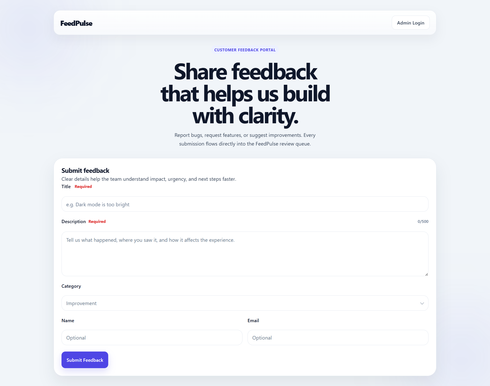
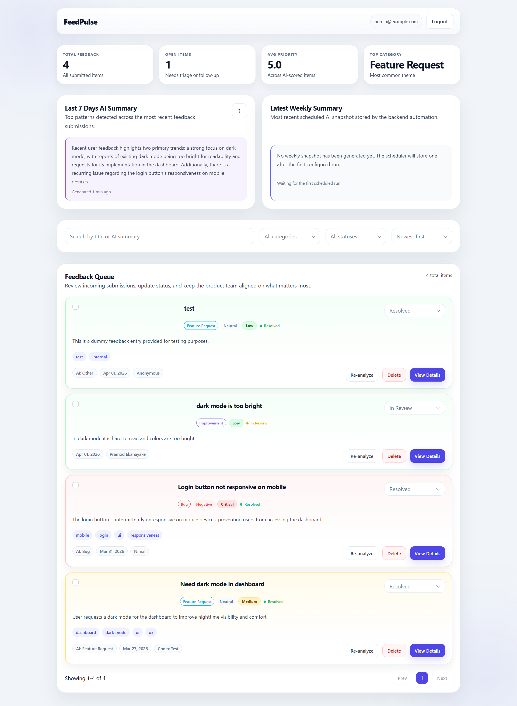

# FeedPulse Product Feedback System 🚀

[](https://nextjs.org/)
[](https://reactjs.org/)
[](https://www.typescriptlang.org/)
[](https://expressjs.com/)
[](https://www.mongodb.com/)
[](https://ai.google.dev/)

**FeedPulse** is a professional, full-stack product feedback platform designed to streamline how organizations collect, analyze, and manage user feedback. By leveraging the power of **Google Gemini AI**, FeedPulse automatically categorizes and summarizes incoming feedback, allowing teams to focus on what matters most—building better products.

---

## 🌟 Key Features

### 📨 Public Experience
A seamless and intuitive feedback submission process for your users.
- **Responsive Feedback Form**: Built with Next.js for a fast, modern user experience.
- **Real-time Validation**: Client-side validation ensures high-quality submissions.
- **Character Counter**: Helps users stay concise while providing enough detail.
- **Success/Error States**: Immediate visual feedback after submission.



### 🤖 AI Features (Powered by Gemini)
Intelligence is at the core of FeedPulse. Every submission is automatically processed by Google's Gemini AI.
- **Automated Analysis**: Instant extraction of category, sentiment, priority, and key tags.
- **Smart Summarization**: Generates a concise summary for quick scanning by admins.
- **Theme Extraction**: Endpoints available for 7-day theme analysis across all feedback.
- **Manual Re-analysis**: Trigger AI refinement directly from the admin dashboard.
- **Graceful Fallback**: Robust error handling ensures system stability even if AI services are unavailable.

### 🔐 Admin Features
A comprehensive dashboard for product managers and developers to oversee user sentiment.
- **Protected Dashboard**: Secure admin access via JWT authentication.
- **Feedback Management**: Paginated list view with powerful search and filter capabilities.
- **Advanced Sorting**: Sort by date, priority, sentiment, or title to find critical issues.
- **Inline Updates**: Change feedback status (Pending, In Progress, Resolved) instantly.
- **AI Re-trigger**: Refresh AI analysis if the original submission was unclear.
- **Quick Deletion**: Easily remove spam or irrelevant feedback.



---

## 🛠️ Tech Stack

| Layer | Technologies |
| :--- | :--- |
| **Frontend** | Next.js 15, React 19, TypeScript, Tailwind CSS |
| **Backend** | Node.js, Express, TypeScript |
| **Database** | MongoDB, Mongoose |
| **AI/ML** | Google Gemini API (`@google/genai`) |
| **Auth** | JSON Web Tokens (JWT) |
| **Testing** | Jest |
| **DevOps** | Docker |

---

## 📂 Project Structure

```text
feedpulse-product-feedback-system/
├── frontend/
│   ├── app/
│   │   ├── dashboard/
│   │   ├── login/
│   │   ├── globals.css
│   │   ├── layout.tsx
│   │   └── page.tsx
│   ├── lib/
│   ├── package.json
│   └── .env.local.example
├── backend/
│   ├── src/
│   │   ├── config/
│   │   ├── controllers/
│   │   ├── middleware/
│   │   ├── models/
│   │   ├── routes/
│   │   ├── services/
│   │   └── tests/
│   ├── feedback.http
│   ├── package.json
│   └── .env.example
├── docs/
│   └── screenshots/
├── README.md
├── docker-compose.yml 
└── .gitignore
```
---

## 🚀 How To Run Locally

### 1. Prerequisites
- **Node.js** (v18+)
- **MongoDB** (Local instance or Atlas)
- **Gemini API Key** (Get one at [aistudio.google.com](https://aistudio.google.com/))

### 2. Setup Environment Variables
Clone the repository and create `.env` files for both frontend and backend.

**Backend (`backend/.env`):**
```env
PORT=4000
MONGO_URI=your_mongodb_connection_string
GEMINI_API_KEY=your_gemini_api_key
JWT_SECRET=your_secret_key
ADMIN_EMAIL=admin@example.com
ADMIN_PASSWORD=admin123
CLIENT_URL=http://localhost:3000
```

**Frontend (`frontend/.env.local`):**
```env
NEXT_PUBLIC_API_URL=http://localhost:4000
```

### 3. Installation & Execution
Launch the backend and frontend in separate terminals:

```bash
# Terminal 1: Backend
cd backend
npm install
npm run dev

# Terminal 2: Frontend
cd frontend
npm install
npm start
```

The application will be available at `http://localhost:3000`.

---

## 🐳 How To Run With Docker

FeedPulse is fully containerized for easy deployment and local testing.

### 1. Configure Docker Env
Create a `.env` file in the root directory (copy from `.env.docker.example`):
```bash
cp .env.docker.example .env
```
Fill in your `GEMINI_API_KEY`.

### 2. Start the System
Run the following command to build and start all services (Frontend, Backend, MongoDB):
```bash
docker compose up --build
```
Everything will be up and running:
- **Frontend**: `http://localhost:3000`
- **Backend API**: `http://localhost:4000`

---

## 🛡️ Admin Credentials
The default admin account is configured via environment variables. By default:
- **Email**: `admin@example.com`
- **Password**: `admin123`

---

## 📈 Roadmap & Future Improvements
- [ ] **Advanced Analytics**: Dashboard charts for feedback trends.
- [ ] **Rate Limiting**: Enhanced security for public submissions.
- [ ] **Email Notifications**: Alerts for admins when high-priority feedback arrives.
- [ ] **Integration Tests**: Comprehensive E2E testing for the entire flow.

---

## 📄 License
Distributed under the MIT License. See `LICENSE` for more information.

---
