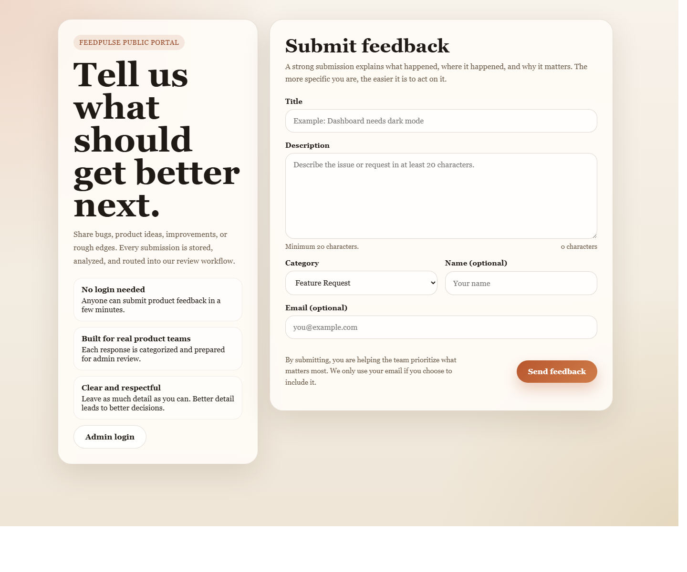
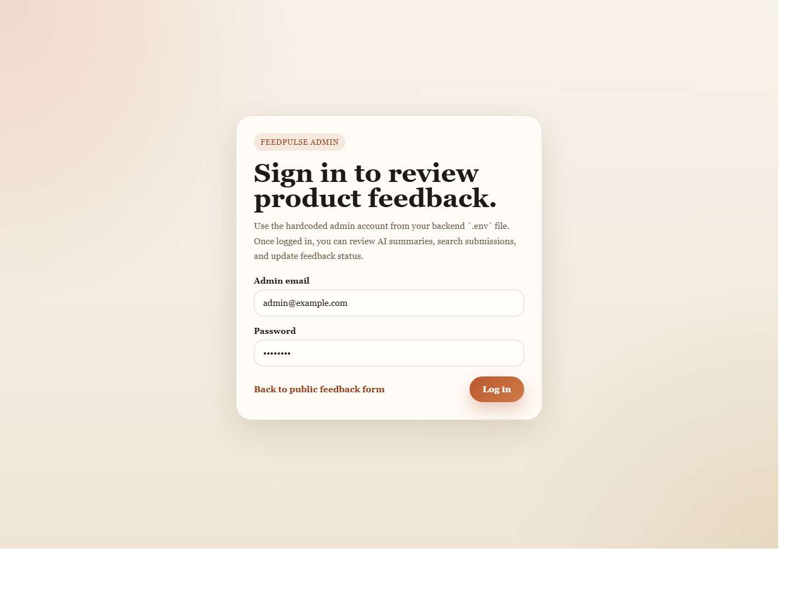

# FeedPulse Product Feedback System

FeedPulse is a full-stack product feedback platform built for the Software Engineer Intern assignment.

Users can submit feedback through a public form, the backend stores it in MongoDB, Gemini analyzes it automatically, and admins can review everything from a protected dashboard.

## What Is Built

### Public experience

- Public feedback form with client-side validation
- Title, description, category, name, and email fields
- Description character counter
- Success and error states after submission
- Submissions sent to the backend API

### Backend API

- Express + TypeScript backend
- MongoDB + Mongoose connection
- Feedback schema with validation and indexes
- `POST /api/feedback`
- `GET /api/feedback`
- `GET /api/feedback/:id`
- `PATCH /api/feedback/:id`
- `DELETE /api/feedback/:id`
- `GET /api/feedback/summary`
- `POST /api/feedback/:id/reanalyze`
- `POST /api/auth/login`

### AI features

- Gemini analysis on feedback submission
- AI category, sentiment, priority, summary, and tags saved to MongoDB
- Graceful fallback when Gemini fails
- 7-day summary endpoint for recent feedback themes
- Manual AI re-trigger for any feedback item

### Admin experience

- Admin login page
- Protected dashboard using JWT token stored in local storage
- Feedback list with pagination
- Search by title and AI summary
- Filter by category and status
- Sort by date, priority, sentiment, or title
- Inline status update
- Inline AI re-analysis
- Real delete action from dashboard
- Better loading and empty states

## Tech Stack

- Frontend: Next.js 15 + React 19 + TypeScript
- Backend: Node.js + Express + TypeScript
- Database: MongoDB + Mongoose
- AI: Google Gemini via `@google/genai`
- Auth: JWT
- Testing: Jest + ts-jest

## Project Structure

```text
feedpulse-product-feedback-system/
├── frontend/
│   ├── app/
│   │   ├── dashboard/
│   │   ├── login/
│   │   ├── globals.css
│   │   ├── layout.tsx
│   │   └── page.tsx
│   ├── lib/
│   ├── package.json
│   └── .env.local.example
├── backend/
│   ├── src/
│   │   ├── config/
│   │   ├── controllers/
│   │   ├── middleware/
│   │   ├── models/
│   │   ├── routes/
│   │   ├── services/
│   │   └── tests/
│   ├── feedback.http
│   ├── package.json
│   └── .env.example
├── docs/
│   └── screenshots/
├── README.md
└── .gitignore
```

## Screenshots

### Public feedback form



### Admin login page



## Environment Variables

### Backend: `backend/.env`

```env
PORT=4000
MONGO_URI=your_mongodb_connection_string
GEMINI_API_KEY=your_gemini_api_key
JWT_SECRET=your_long_random_secret
ADMIN_EMAIL=admin@example.com
ADMIN_PASSWORD=admin123
CLIENT_URL=http://localhost:3000
```

### Frontend: `frontend/.env.local`

```env
NEXT_PUBLIC_API_URL=http://localhost:4000
```

## How To Run Locally

### 1. Clone and open the project

```powershell
git clone <your-repo-url>
cd F:\GITHUB\feedpulse-product-feedback-system
```

### 2. Create env files

```powershell
Copy-Item backend\.env.example backend\.env
Copy-Item frontend\.env.local.example frontend\.env.local
```

Then fill in the real values.

### 3. Install backend dependencies

```powershell
cd backend
npm install
```

### 4. Install frontend dependencies

Open a second terminal:

```powershell
cd F:\GITHUB\feedpulse-product-feedback-system\frontend
npm install
```

### 5. Start backend

```powershell
cd F:\GITHUB\feedpulse-product-feedback-system\backend
npm run dev
```

Expected:

- backend runs on `http://localhost:4000`
- MongoDB connects successfully

### 6. Start frontend

In another terminal:

```powershell
cd F:\GITHUB\feedpulse-product-feedback-system\frontend
npm run dev
```

Expected:

- frontend runs on `http://localhost:3000`

### 7. Open the app

- Public form: [http://localhost:3000](http://localhost:3000)
- Admin login: [http://localhost:3000/login](http://localhost:3000/login)
- Dashboard: [http://localhost:3000/dashboard](http://localhost:3000/dashboard)

## Admin Login

Use the credentials from `backend/.env`.

Example:

```env
ADMIN_EMAIL=admin@example.com
ADMIN_PASSWORD=admin123
```

## Backend Testing

### Manual API checks

Use:

[backend/feedback.http](backend/feedback.http)

It includes requests for:

- public feedback submission
- admin login
- summary endpoint
- list endpoint
- single item fetch
- reanalyze endpoint
- status update
- delete

### Automated tests

Run:

```powershell
cd F:\GITHUB\feedpulse-product-feedback-system\backend
npm test
```

Current test coverage includes:

- Gemini service helper normalization
- JWT auth middleware unauthorized case
- feedback controller validation
- paginated feedback list behavior

## Current Status

Implemented well:

- backend CRUD
- Gemini integration
- summary + reanalyze endpoints
- admin auth middleware
- public form
- admin login page
- protected dashboard
- backend tests

Still good next steps if more time is available:

- dashboard screenshots
- stronger token persistence strategy
- backend integration tests with mocked DB/API layers
- deploy frontend and backend
- Docker setup

## What I Would Build Next

If I had more time, I would add:

- dashboard charts and aggregate metrics
- rate limiting on public submissions
- integration tests for API endpoints
- deployment to Vercel + Render
- Docker Compose for one-command local startup
